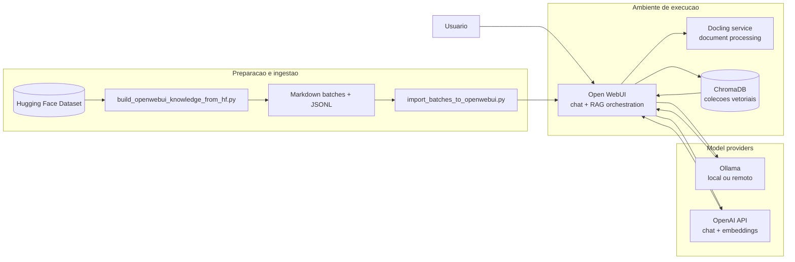
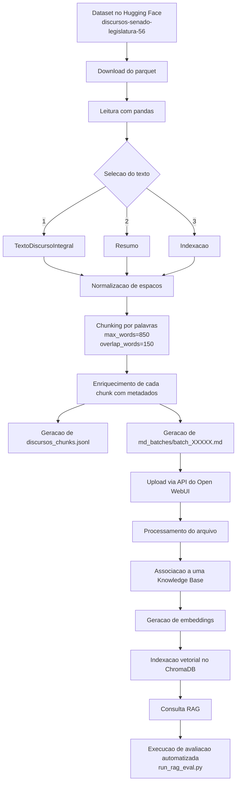

# Chatbot Legislativo com RAG

Projeto final da disciplina de Inteligência Artificial Generativa. A solução implementa um chatbot legislativo para consultas auditáveis sobre discursos da 56ª Legislatura do Senado Federal (2019-2023), usando recuperação semântica, geração orientada por contexto e rastreabilidade por metadados.

O objetivo deste diretório é permitir que outra pessoa:

- entenda a arquitetura técnica da solução;
- regenere a base de conhecimento a partir do dataset original;
- suba o ambiente localmente;
- use provedores em nuvem para embeddings, geração e banco vetorial;
- importe os dados no Open WebUI;
- execute avaliações reproduzíveis do RAG.

O artigo acadêmico anexado neste diretório complementa a fundamentação teórica e a discussão dos resultados. Este README foca na replicação técnica da solução.

## 1. O que foi construído

A solução combina:

- `Open WebUI` como interface de chat, orquestração do fluxo RAG e ponto de ingestão da knowledge base;
- `ChromaDB` como banco vetorial;
- `Ollama` como opção para modelos locais de geração e embeddings;
- `OpenAI API` como opção para geração e embeddings;
- scripts Python para:
  - baixar o dataset no Hugging Face;
  - selecionar o texto prioritário de cada discurso;
  - gerar chunks com metadados;
  - produzir lotes Markdown compatíveis com o Open WebUI;
  - importar lotes via API;
  - avaliar automaticamente a knowledge base.

## 2. Escopo do corpus

- Fonte lógica: dataset `fabriciosantana/discursos-senado-legislatura-56`
- Fonte original do dado: dados abertos do Senado Federal
- Recorte temporal: 2019-02-01 a 2023-01-31
- Unidade documental: discursos da 56ª Legislatura do Senado Federal

Regras de seleção textual implementadas em [`scripts/build_openwebui_knowledge_from_hf.py`](/workspaces/mcdia/05-iag/4-project/scripts/build_openwebui_knowledge_from_hf.py):

1. usar `TextoDiscursoIntegral` quando disponível;
2. usar `Resumo` como fallback;
3. usar `Indexacao` como fallback final.

Cada chunk carrega metadados úteis para auditabilidade:

- data;
- autor;
- partido;
- UF;
- casa;
- tipo de uso da palavra;
- resumo;
- indexação;
- URL do texto integral.

## 3. Estrutura do diretório

```text
05-iag/4-project/
├── .env.example
├── docker-compose.yaml
├── README.md
├── Relatório - Chatbot Legislativo com RAG para respostas auditáveis...
├── eval/
│   ├── RUBRIC.md
│   └── discursos_questions.json
├── knowledge_openwebui/
│   └── README_IMPORT.md
└── scripts/
    ├── build_openwebui_knowledge_from_hf.py
    ├── import_batches_to_openwebui.py
    ├── run_rag_eval.py
    ├── test_chroma_cloud_client.py
    └── test_chroma_connection.py
```

Observação importante: os artefatos gerados (`discursos_chunks.jsonl`, `md_batches/` e `build_metadata.json`) não estão versionados neste diretório no estado atual do repositório. Eles podem ser regenerados pelo script de build descrito abaixo.

## 4. Arquitetura da solução



### Fluxo de consulta

1. o usuário envia uma pergunta ao Open WebUI;
2. a pergunta é transformada em embedding pelo provedor configurado;
3. o Open WebUI consulta a collection no ChromaDB;
4. os chunks mais relevantes são agregados ao contexto;
5. o modelo gerador produz a resposta com base no contexto recuperado;
6. a resposta pode citar metadados e trechos que permitem auditoria posterior.

## 5. Pipeline de dados: extração, preparação e ingestão



## 6. Stack e decisões técnicas

### Serviços

- `open-webui`: interface, API e orquestração do RAG
- `chromadb`: persistência vetorial
- `docling`: processamento de documentos dentro do fluxo do Open WebUI

### Parâmetros principais observados no projeto

- chunking no script de preparação:
  - `max_words=850`
  - `overlap_words=150`
  - `chunks_per_file=200`
- parâmetros de embeddings:
  - engine local: `ollama`
  - engine remota validada no experimento: `openai`
- parâmetros de ingestão no Open WebUI:
  - lote de embeddings: `32`

### Escala registrada no artigo

Na execução completa descrita no artigo:

- `15.729` registros de entrada foram lidos;
- `15.726` registros resultaram em texto útil;
- `3` registros foram descartados;
- `23.806` chunks foram gerados;
- `120` arquivos Markdown de ingestão foram produzidos.

Esses números são úteis como referência para validar uma nova execução do pipeline.

## 7. Pré-requisitos

### Infraestrutura

- Docker e Docker Compose
- Python 3.10+ para os scripts auxiliares
- acesso à internet para:
  - baixar imagens Docker;
  - baixar o dataset no Hugging Face;
  - acessar OpenAI, se essa opção for usada;
  - acessar um Ollama remoto, se essa opção for usada;
  - acessar Chroma Cloud, se essa opção for usada.

### Dependências Python para os scripts

Se você quiser regenerar os artefatos, testar conectividade ou rodar a avaliação fora do container:

```bash
python -m venv .venv
source .venv/bin/activate
pip install pandas pyarrow huggingface_hub requests chromadb
```

`pyarrow` é necessário para leitura do arquivo parquet.

## 8. Configuração do ambiente

Crie o arquivo `.env`:

```bash
cd /workspaces/mcdia/05-iag/4-project
cp .env.example .env
```

### Variáveis principais

| Variável | Uso |
|---|---|
| `OPENAI_API_KEY` | geração de respostas via OpenAI |
| `OPENAI_MODEL` | modelo usado para geração |
| `RAG_EMBEDDING_ENGINE` | `ollama` ou `openai` |
| `RAG_EMBEDDING_MODEL` | modelo de embedding |
| `RAG_OPENAI_API_KEY` | embeddings via OpenAI |
| `OLLAMA_BASE_URL` | endpoint do Ollama local ou remoto |
| `OLLAMA_API_KEY` | token do Ollama remoto, se existir |
| `CHROMA_HTTP_HOST` | host do Chroma |
| `CHROMA_HTTP_PORT` | porta HTTP/HTTPS do Chroma |
| `CHROMA_HTTP_SSL` | `true` ou `false` |
| `CHROMA_TENANT` | tenant do Chroma |
| `CHROMA_DATABASE` | database do Chroma |
| `CHROMA_HTTP_HEADERS` | cabeçalhos extras, ex.: token |
| `OPENWEBUI_URL` | URL da instância do Open WebUI usada pelos scripts |
| `OPENWEBUI_API_KEY` | chave da API do Open WebUI usada pelos scripts |

### Perfis de configuração suportados

#### Perfil 1: local puro

- geração: Ollama local
- embeddings: Ollama local
- vetor: Chroma local

Configuração típica:

```bash
OLLAMA_BASE_URL=http://localhost:11434
RAG_EMBEDDING_ENGINE=ollama
RAG_EMBEDDING_MODEL=qwen3-embedding:0.6b
CHROMA_HTTP_HOST=localhost
CHROMA_HTTP_PORT=8000
CHROMA_HTTP_SSL=false
CHROMA_TENANT=default_tenant
CHROMA_DATABASE=default_database
```

#### Perfil 2: híbrido validado no projeto

- geração: OpenAI
- embeddings: OpenAI
- vetor: Chroma local ou remoto

Configuração típica:

```bash
OPENAI_API_BASE_URL=https://api.openai.com/v1
OPENAI_API_KEY=<sua_chave>
OPENAI_MODEL=gpt-5.4-nano

RAG_EMBEDDING_ENGINE=openai
RAG_EMBEDDING_MODEL=text-embedding-3-small
RAG_OPENAI_API_BASE_URL=https://api.openai.com/v1
RAG_OPENAI_API_KEY=<sua_chave>
```

#### Perfil 3: Ollama remoto

```bash
OLLAMA_BASE_URL=https://<seu-endpoint-ollama>
OLLAMA_API_KEY=<seu_token_se_houver>
```

#### Perfil 4: Chroma Cloud

```bash
VECTOR_DB=chroma
CHROMA_HTTP_HOST=api.trychroma.com
CHROMA_HTTP_PORT=443
CHROMA_HTTP_SSL=true
CHROMA_TENANT=<tenant>
CHROMA_DATABASE=<database>
CHROMA_HTTP_HEADERS=X-Chroma-Token=<token>
```

## 9. Como iniciar o ambiente local

Entre no diretório do projeto:

```bash
cd /workspaces/mcdia/05-iag/4-project
```

Suba os serviços:

```bash
docker compose up -d
```

Verifique o estado:

```bash
docker compose ps
```

Como o `docker-compose.yaml` usa `network_mode: host`, os serviços ficam expostos nas portas padrão do próprio processo:

- Open WebUI: `http://localhost:8080`
- ChromaDB: `http://localhost:8000`
- Docling: `http://localhost:5001`

Para acompanhar logs:

```bash
docker compose logs -f open-webui
docker compose logs -f chromadb
docker compose logs -f docling
```

Para parar:

```bash
docker compose down
```

## 10. Como usar com Ollama local

Se você quiser usar modelos locais para geração e embeddings, instale e suba o Ollama no host.

Exemplo de preparação:

```bash
curl -fsSL https://ollama.com/install.sh | sh
ollama pull qwen3-embedding:0.6b
ollama pull llama3.2:3b
ollama serve
```

Depois, ajuste o `.env` para apontar para `http://localhost:11434`.

## 11. Como usar o ambiente na nuvem

### 11.1 Ollama remoto

Se você possui um endpoint HTTP compatível com a API do Ollama:

```bash
export OLLAMA_BASE_URL=https://<endpoint-remoto>
export OLLAMA_API_KEY=<token-se-houver>
docker compose up -d
```

Esse modo é útil quando a inferência roda em outra máquina com GPU.

### 11.2 OpenAI para embeddings e geração

```bash
export OPENAI_API_KEY=<sua_chave>
export RAG_OPENAI_API_KEY=<sua_chave>
export RAG_EMBEDDING_ENGINE=openai
export RAG_EMBEDDING_MODEL=text-embedding-3-small
docker compose up -d
```

Use esse perfil quando quiser evitar dependência de modelos locais.

### 11.3 Chroma Cloud

Configure o `.env` e valide a conectividade antes da ingestão:

```bash
python scripts/test_chroma_connection.py
```

Alternativamente, se você usar `CHROMA_API_KEY`:

```bash
export CHROMA_API_KEY=<token>
export CHROMA_TENANT=<tenant>
export CHROMA_DATABASE=<database>
python scripts/test_chroma_cloud_client.py
```

## 12. Regenerando os artefatos da knowledge base

Use este passo quando `knowledge_openwebui/md_batches/` não estiver presente ou quando você quiser reconstruir a base.

Comando completo:

```bash
python scripts/build_openwebui_knowledge_from_hf.py \
  --repo-id fabriciosantana/discursos-senado-legislatura-56 \
  --parquet-path data/full/discursos_2019-02-01_2023-01-31.parquet \
  --output-dir knowledge_openwebui \
  --max-words 850 \
  --overlap-words 150 \
  --chunks-per-file 200
```

Saídas esperadas:

- `knowledge_openwebui/discursos_chunks.jsonl`
- `knowledge_openwebui/build_metadata.json`
- `knowledge_openwebui/md_batches/batch_00001.md` ... `batch_00120.md`

Para teste rápido:

```bash
python scripts/build_openwebui_knowledge_from_hf.py \
  --output-dir knowledge_openwebui \
  --limit-rows 100
```

## 13. Ingestão no Open WebUI

### 13.1 Preparar a knowledge base

1. acesse `http://localhost:8080`;
2. crie a conta administrativa, se for a primeira execução;
3. crie uma Knowledge Base, por exemplo: `Discursos do plenário do Senado 2019-2023`.

### 13.2 Gerar a chave da API do Open WebUI

Os scripts de importação e avaliação usam:

```bash
OPENWEBUI_URL=http://localhost:8080
OPENWEBUI_API_KEY=<sua_chave>
```

Salve essas variáveis no `.env`.

### 13.3 Descobrir o `knowledge_id`

```bash
curl -s \
  -H "Authorization: Bearer $OPENWEBUI_API_KEY" \
  "$OPENWEBUI_URL/api/v1/knowledge/" | jq
```

### 13.4 Importar todos os lotes

```bash
python scripts/import_batches_to_openwebui.py \
  --knowledge-id <knowledge_id> \
  --pattern 'knowledge_openwebui/md_batches/batch_*.md'
```

### 13.5 Retomar de um lote específico

```bash
python scripts/import_batches_to_openwebui.py \
  --knowledge-id <knowledge_id> \
  --pattern 'knowledge_openwebui/md_batches/batch_*.md' \
  --start-from batch_00031.md
```

### 13.6 Testar com poucos arquivos

```bash
python scripts/import_batches_to_openwebui.py \
  --knowledge-id <knowledge_id> \
  --pattern 'knowledge_openwebui/md_batches/batch_*.md' \
  --limit 3
```

### 13.7 Tolerância a rate limit

Se a etapa de embeddings no provedor remoto retornar `429`, use retries mais conservadores:

```bash
python scripts/import_batches_to_openwebui.py \
  --knowledge-id <knowledge_id> \
  --pattern 'knowledge_openwebui/md_batches/batch_*.md' \
  --max-add-retries 10 \
  --initial-backoff 15 \
  --max-backoff 180
```

## 14. Avaliação do RAG

Arquivos relevantes:

- [`eval/discursos_questions.json`](/workspaces/mcdia/05-iag/4-project/eval/discursos_questions.json)
- [`eval/RUBRIC.md`](/workspaces/mcdia/05-iag/4-project/eval/RUBRIC.md)
- [`scripts/run_rag_eval.py`](/workspaces/mcdia/05-iag/4-project/scripts/run_rag_eval.py)

Execução padrão:

```bash
python scripts/run_rag_eval.py
```

Executar apenas as 3 primeiras perguntas:

```bash
python scripts/run_rag_eval.py --limit 3
```

Trocar o modelo:

```bash
python scripts/run_rag_eval.py --model gpt-5-nano
```

Aumentar a pausa entre perguntas:

```bash
python scripts/run_rag_eval.py --sleep-between 5
```

Resultados gerados:

- `eval/results/*.jsonl`
- `eval/results/*.md`
- `eval/results/*.csv`

O `.csv` serve como planilha-base para revisão manual com a rubrica.

## 15. Comandos úteis de operação

### Validar conectividade com Chroma

```bash
python scripts/test_chroma_connection.py
```

### Inspecionar knowledges cadastradas

```bash
curl -s \
  -H "Authorization: Bearer $OPENWEBUI_API_KEY" \
  "$OPENWEBUI_URL/api/v1/knowledge/" | jq
```

### Ver status dos containers

```bash
docker compose ps
```

### Reiniciar a stack

```bash
docker compose down
docker compose up -d
```

## 16. Limitações práticas observadas

- perguntas factuais e bem delimitadas tendem a performar melhor do que perguntas muito amplas;
- o desempenho é sensível à estratégia de chunking;
- mudar o modelo de embedding pode exigir reindexação completa;
- quando embeddings e geração dependem de provedores externos, custo, latência e rate limit passam a fazer parte do desenho operacional;
- a qualidade final depende da combinação entre retrieval, prompt, chunking e formulação da pergunta.

## 17. Ordem recomendada para replicação

1. configurar `.env`;
2. subir `docker compose up -d`;
3. validar Chroma local ou remoto;
4. regenerar `knowledge_openwebui/` se os lotes não estiverem presentes;
5. criar a Knowledge Base no Open WebUI;
6. importar os batches;
7. testar perguntas manualmente na interface;
8. executar `run_rag_eval.py`;
9. revisar os resultados com a rubrica.

## 18. Arquivos-chave para leitura rápida

- [`docker-compose.yaml`](/workspaces/mcdia/05-iag/4-project/docker-compose.yaml): serviços e integração da stack
- [`.env.example`](/workspaces/mcdia/05-iag/4-project/.env.example): configuração-base
- [`scripts/build_openwebui_knowledge_from_hf.py`](/workspaces/mcdia/05-iag/4-project/scripts/build_openwebui_knowledge_from_hf.py): preparação da base
- [`scripts/import_batches_to_openwebui.py`](/workspaces/mcdia/05-iag/4-project/scripts/import_batches_to_openwebui.py): ingestão automatizada
- [`scripts/run_rag_eval.py`](/workspaces/mcdia/05-iag/4-project/scripts/run_rag_eval.py): avaliação automatizada
- [`Relatório - Chatbot Legislativo com RAG para respostas auditáveis sobre discursos da 56ª Legislatura do Senado Federal.pdf`](/workspaces/mcdia/05-iag/4-project/Relatório%20-%20Chatbot%20Legislativo%20com%20RAG%20para%20respostas%20audit%C3%A1veis%20sobre%20discursos%20da%2056%C2%AA%20Legislatura%20do%20Senado%20Federal.pdf): fundamentação teórica e resultados do trabalho
