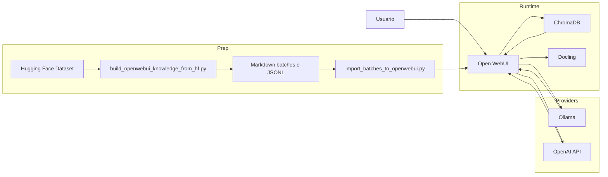
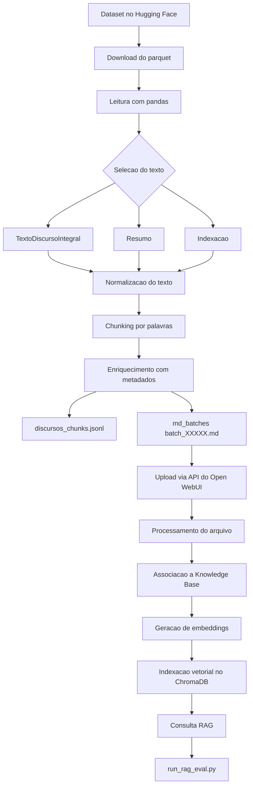

# Chatbot Legislativo com RAG

A solução implementa um chatbot legislativo para consultas auditáveis sobre discursos da 56ª Legislatura do Senado Federal (2019-2023), aplicando a estratégia _retrieval augmented generation_, que usa recuperação semântica, geração orientada por contexto e oferece rastreabilidade por metadados.

## 1. Componentes

A solução combina:

- `Open WebUI` como interface de chat, orquestração do fluxo RAG e ponto de ingestão da _knowledge base_;
- `ChromaDB` como banco vetorial;
- `Ollama` como opção para modelos locais de geração e embeddings;
- `OpenAI API` como opção para geração e embeddings por meio de API;
- scripts Python para:
  - baixar o dataset no Hugging Face;
  - selecionar o texto prioritário de cada discurso;
  - gerar chunks com metadados;
  - produzir lotes Markdown (pré-chuncks);
  - importar lotes via API (opcionalmente, é possível importar os dados manualmente);
  - avaliar automaticamente a knowledge base.

## 2. Escopo do corpus

- Fonte original do dado: dados abertos do Senado Federal
- Fonte derivada: dataset `fabriciosantana/discursos-senado-legislatura-56`(https://huggingface.co/datasets/fabriciosantana/discursos-senado-legislatura-56)
- Recorte temporal: 2019-02-01 a 2023-01-31 (56ª Legislatura do Senado Federal)
- Unidade documental: discursos da 56ª Legislatura do Senado Federal

Scripts de preparação de dados para importação no Open WebUI disponível em [`scripts/build_openwebui_knowledge_from_hf.py`](/workspaces/mcdia/05-iag/4-project/scripts/build_openwebui_knowledge_from_hf.py). Cada chunk carrega metadados úteis para auditabilidade:
- data;
- autor;
- partido;
- UF;
- casa;
- tipo de uso da palavra;
- resumo;
- indexação;
- URL do texto integral.

## 3. Estrutura do diretório

```text
05-iag/4-project/
├── .env.example
├── docker-compose.yaml
├── README.md
├── eval/
│   ├── RUBRIC.md
│   └── discursos_questions.json
├── knowledge_openwebui/
│   └── README_IMPORT.md
└── scripts/
    ├── build_openwebui_knowledge_from_hf.py
    ├── import_batches_to_openwebui.py
    ├── run_rag_eval.py
    ├── test_chroma_cloud_client.py
    └── test_chroma_connection.py
```

## 4. Arquitetura da solução



### Fluxo de consulta

1. o usuário envia uma pergunta ao Open WebUI;
2. a pergunta é transformada em embedding pelo provedor configurado;
3. o Open WebUI consulta a collection no ChromaDB;
4. os chunks mais relevantes são agregados ao contexto;
5. o modelo gerador produz a resposta com base no contexto recuperado;
6. a resposta pode citar metadados e trechos que permitem auditoria posterior.

## 5. Pipeline de dados: extração, preparação e ingestão



## 6. Stack e decisões técnicas

### Serviços

- `open-webui`: interface, API e orquestração do RAG
- `chromadb`: persistência vetorial
- `docling`: processamento de documentos dentro do fluxo do Open WebUI

### Parâmetros principais usados no projeto

- chunking no script de preparação:
  - `max_words=850`
  - `overlap_words=150`
  - `chunks_per_file=200`
- parâmetros de embeddings:
  - engine local: `ollama`
  - engine remota validada no experimento: `openai`
- parâmetros de ingestão no Open WebUI:
  - lote de embeddings: `32`

## 7. Pré-requisitos

### Infraestrutura

- Docker e Docker Compose
- Python 3.10+ para os scripts auxiliares
- acesso à internet para:
  - baixar imagens Docker;
  - baixar o dataset no Hugging Face;
  - acessar OpenAI, se essa opção for usada;
  - acessar um Ollama remoto, se essa opção for usada;
  - acessar Chroma Cloud, se essa opção for usada.

### Dependências Python para os scripts

Se você quiser regenerar os artefatos, testar conectividade ou rodar a avaliação fora do container:

```bash
python -m venv .venv
source .venv/bin/activate
pip install pandas pyarrow huggingface_hub requests chromadb
```

## 8. Configuração do ambiente

Crie o arquivo `.env`:

```bash
cd /workspaces/mcdia/05-iag/4-project
cp .env.example .env
```

### Variáveis principais

| Variável | Uso |
|---|---|
| `OPENAI_API_KEY` | geração de respostas via OpenAI |
| `OPENAI_MODEL` | modelo usado para geração |
| `RAG_EMBEDDING_ENGINE` | `ollama` ou `openai` |
| `RAG_EMBEDDING_MODEL` | modelo de embedding |
| `RAG_OPENAI_API_KEY` | embeddings via OpenAI |
| `OLLAMA_BASE_URL` | endpoint do Ollama local ou remoto |
| `OLLAMA_API_KEY` | token do Ollama remoto, se existir |
| `CHROMA_HTTP_HOST` | host do Chroma |
| `CHROMA_HTTP_PORT` | porta HTTP/HTTPS do Chroma |
| `CHROMA_HTTP_SSL` | `true` ou `false` |
| `CHROMA_TENANT` | tenant do Chroma |
| `CHROMA_DATABASE` | database do Chroma |
| `CHROMA_HTTP_HEADERS` | cabeçalhos extras, ex.: token |
| `OPENWEBUI_URL` | URL da instância do Open WebUI usada pelos scripts |
| `OPENWEBUI_API_KEY` | chave da API do Open WebUI usada pelos scripts |
| `OPENWEBUI_EVAL_MODEL` | modelo padrão usado pelo `run_rag_eval.py` para gerar respostas |
| `OPENWEBUI_JUDGE_MODEL` | modelo opcional usado para aplicar a rubrica; se vazio, reutiliza `OPENWEBUI_EVAL_MODEL` |
| `RAG_EVAL_TEMPERATURE` | temperatura padrão da bateria de avaliação |
| `RAG_EVAL_TOP_P` | top-p padrão da bateria de avaliação |
| `RAG_EVAL_MAX_TOKENS` | limite padrão de tokens de saída da bateria de avaliação |
| `RAG_EVAL_SEED` | seed opcional da bateria de avaliação, quando o backend suportar |

Observação:
- As variáveis `OPENWEBUI_*` apontam para o serviço/canal usado pelos scripts.
- As variáveis `RAG_EVAL_*` controlam apenas os parâmetros experimentais da bateria executada por `scripts/run_rag_eval.py`.
- Se `RAG_EVAL_*` estiverem vazias, o script usa o padrão do provedor ou do backend.

### Perfis de configuração suportados

#### Perfil 1: local puro

- geração: Ollama local
- embeddings: Ollama local
- vetor: Chroma local

Configuração típica:

```bash
OLLAMA_BASE_URL=http://localhost:11434
RAG_EMBEDDING_ENGINE=ollama
RAG_EMBEDDING_MODEL=qwen3-embedding:0.6b
CHROMA_HTTP_HOST=localhost
CHROMA_HTTP_PORT=8000
CHROMA_HTTP_SSL=false
CHROMA_TENANT=default_tenant
CHROMA_DATABASE=default_database
```

#### Perfil 2: híbrido

- geração: OpenAI
- embeddings: OpenAI
- vetor: Chroma local ou remoto

Configuração típica:

```bash
OPENAI_API_BASE_URL=https://api.openai.com/v1
OPENAI_API_KEY=<sua_chave>
OPENAI_MODEL=gpt-5.4-nano

RAG_EMBEDDING_ENGINE=openai
RAG_EMBEDDING_MODEL=text-embedding-3-small
RAG_OPENAI_API_BASE_URL=https://api.openai.com/v1
RAG_OPENAI_API_KEY=<sua_chave>
```

#### Perfil 3: Ollama remoto

```bash
OLLAMA_BASE_URL=https://<seu-endpoint-ollama>
OLLAMA_API_KEY=<seu_token_se_houver>
```

#### Perfil 4: Chroma Cloud

```bash
VECTOR_DB=chroma
CHROMA_HTTP_HOST=api.trychroma.com
CHROMA_HTTP_PORT=443
CHROMA_HTTP_SSL=true
CHROMA_TENANT=<tenant>
CHROMA_DATABASE=<database>
CHROMA_HTTP_HEADERS=X-Chroma-Token=<token>
```

## 9. Como iniciar o ambiente local

Entre no diretório do projeto:

```bash
cd /workspaces/mcdia/05-iag/4-project
```

Suba os serviços:

```bash
docker compose up -d
```

Verifique o estado:

```bash
docker compose ps
```

Como o `docker-compose.yaml` usa `network_mode: host`, os serviços ficam expostos nas portas padrão do próprio processo:

- Open WebUI: `http://localhost:8080`
- ChromaDB: `http://localhost:8000`
- Docling: `http://localhost:5001`

Para acompanhar logs:

```bash
docker compose logs -f open-webui
docker compose logs -f chromadb
docker compose logs -f docling
```

Para parar:

```bash
docker compose down
```

## 10. Como usar com Ollama local

Se você quiser usar modelos locais para geração e embeddings, instale e suba o Ollama no host.

```bash
curl -fsSL https://ollama.com/install.sh | sh
ollama pull qwen3-embedding:0.6b
ollama pull llama3.2:3b
ollama serve
```

Depois, ajuste o `.env` para apontar para `http://localhost:11434`.

## 11. Como usar o ambiente na nuvem

### 11.1 Ollama remoto

Se você possui um endpoint HTTP compatível com a API do Ollama:

```bash
export OLLAMA_BASE_URL=https://<endpoint-remoto>
export OLLAMA_API_KEY=<token-se-houver>
docker compose up -d
```

Esse modo é útil quando a inferência roda em outra máquina com GPU.

### 11.2 OpenAI para embeddings e geração

```bash
export OPENAI_API_KEY=<sua_chave>
export RAG_OPENAI_API_KEY=<sua_chave>
export RAG_EMBEDDING_ENGINE=openai
export RAG_EMBEDDING_MODEL=text-embedding-3-small
docker compose up -d
```

Use esse perfil quando quiser evitar dependência de modelos locais.

### 11.3 Chroma Cloud

Configure o `.env` e valide a conectividade antes da ingestão:

```bash
python scripts/test_chroma_connection.py
```

Alternativamente, se você usar `CHROMA_API_KEY`:

```bash
export CHROMA_API_KEY=<token>
export CHROMA_TENANT=<tenant>
export CHROMA_DATABASE=<database>
python scripts/test_chroma_cloud_client.py
```

## 12. Regenerando os artefatos da knowledge base

Use este passo quando `knowledge_openwebui/md_batches/` não estiver presente ou quando você quiser reconstruir a base.

```bash
python scripts/build_openwebui_knowledge_from_hf.py \
  --repo-id fabriciosantana/discursos-senado-legislatura-56 \
  --parquet-path data/full/discursos_2019-02-01_2023-01-31.parquet \
  --output-dir knowledge_openwebui \
  --max-words 850 \
  --overlap-words 150 \
  --chunks-per-file 200
```

Saídas esperadas:

- `knowledge_openwebui/discursos_chunks.jsonl`
- `knowledge_openwebui/build_metadata.json`
- `knowledge_openwebui/md_batches/batch_00001.md` ... `batch_00120.md`

Para teste rápido:

```bash
python scripts/build_openwebui_knowledge_from_hf.py \
  --output-dir knowledge_openwebui \
  --limit-rows 100
```

## 13. Ingestão no Open WebUI

### 13.1 Preparar a knowledge base

1. acesse `http://localhost:8080`;
2. crie a conta administrativa, se for a primeira execução;
3. crie uma Knowledge Base, por exemplo: `Discursos do plenário do Senado 2019-2023`.

### 13.2 Gerar a chave da API do Open WebUI

Os scripts de importação e avaliação usam:

```bash
OPENWEBUI_URL=http://localhost:8080
OPENWEBUI_API_KEY=<sua_chave>
```

Salve essas variáveis no `.env`.

### 13.3 Descobrir o `knowledge_id`

```bash
curl -s \
  -H "Authorization: Bearer $OPENWEBUI_API_KEY" \
  "$OPENWEBUI_URL/api/v1/knowledge/" | jq
```

### 13.4 Importar todos os lotes

```bash
python scripts/import_batches_to_openwebui.py \
  --knowledge-id <knowledge_id> \
  --pattern 'knowledge_openwebui/md_batches/batch_*.md'
```

### 13.5 Retomar de um lote específico

```bash
python scripts/import_batches_to_openwebui.py \
  --knowledge-id <knowledge_id> \
  --pattern 'knowledge_openwebui/md_batches/batch_*.md' \
  --start-from batch_00031.md
```

### 13.6 Testar com poucos arquivos

```bash
python scripts/import_batches_to_openwebui.py \
  --knowledge-id <knowledge_id> \
  --pattern 'knowledge_openwebui/md_batches/batch_*.md' \
  --limit 3
```

### 13.7 Tolerância a rate limit

Se a etapa de embeddings no provedor remoto retornar `429`, use retries mais conservadores:

```bash
python scripts/import_batches_to_openwebui.py \
  --knowledge-id <knowledge_id> \
  --pattern 'knowledge_openwebui/md_batches/batch_*.md' \
  --max-add-retries 10 \
  --initial-backoff 15 \
  --max-backoff 180
```

## 14. Avaliação do RAG

- [`eval/discursos_questions.json`](/workspaces/mcdia/05-iag/4-project/eval/discursos_questions.json)
- [`eval/discursos_questions_v2_balanced.json`](/workspaces/mcdia/05-iag/4-project/eval/discursos_questions_v2_balanced.json)
- [`eval/RUBRIC.md`](/workspaces/mcdia/05-iag/4-project/eval/RUBRIC.md)
- [`eval/prompts/rag_prompt.md`](/workspaces/mcdia/05-iag/4-project/eval/prompts/rag_prompt.md)
- [`eval/prompts/rag_judge_system.md`](/workspaces/mcdia/05-iag/4-project/eval/prompts/rag_judge_system.md)
- [`eval/prompts/rag_judge_user.md`](/workspaces/mcdia/05-iag/4-project/eval/prompts/rag_judge_user.md)
- [`scripts/run_rag_eval.py`](/workspaces/mcdia/05-iag/4-project/scripts/run_rag_eval.py)
- [`scripts/build_question_analysis.py`](/workspaces/mcdia/05-iag/4-project/scripts/build_question_analysis.py)
- [`scripts/build_manual_validation_sample.py`](/workspaces/mcdia/05-iag/4-project/scripts/build_manual_validation_sample.py)
- [`scripts/summarize_eval_results.py`](/workspaces/mcdia/05-iag/4-project/scripts/summarize_eval_results.py)

### 14.1 Protocolo oficial reproduzível

O protocolo oficial desta fase do projeto adota a **Opção A**:

- a bateria automatizada deve espelhar o mais fielmente possível o fluxo interativo do Open WebUI;
- o `run_rag_eval.py` usa por padrão `--answer-prompt-role=none`;
- nesse modo, o script envia apenas a pergunta e a `collection`, deixando o servidor aplicar o `RAG_TEMPLATE` configurado no Open WebUI;
- o arquivo [`eval/prompts/rag_prompt.md`](/workspaces/mcdia/05-iag/4-project/eval/prompts/rag_prompt.md:1) é mantido como referência versionada do template RAG esperado no servidor.

### 14.2 Pré-condições para uma rodada válida

Antes de executar uma rodada que será usada em comparação metodológica:

1. confirme que o Open WebUI está acessível em `OPENWEBUI_URL`;
2. confirme que a knowledge base correta existe e está indexada;
3. confirme que o `RAG_TEMPLATE` ativo no Open WebUI corresponde a [`eval/prompts/rag_prompt.md`](/workspaces/mcdia/05-iag/4-project/eval/prompts/rag_prompt.md:1);
4. confirme que o conjunto de perguntas e a rubrica são os arquivos versionados do repositório;
5. mantenha estáveis os parâmetros experimentais `RAG_EVAL_*`, quando usados.

### 14.3 Entradas obrigatórias da rodada

Uma rodada comparável precisa fixar explicitamente:

- `knowledge_name`
- `knowledge_id`
- arquivo de perguntas: [`eval/discursos_questions.json`](/workspaces/mcdia/05-iag/4-project/eval/discursos_questions.json:1)
- prompt RAG de referência: [`eval/prompts/rag_prompt.md`](/workspaces/mcdia/05-iag/4-project/eval/prompts/rag_prompt.md:1)
- prompt do juiz: [`eval/prompts/rag_judge_system.md`](/workspaces/mcdia/05-iag/4-project/eval/prompts/rag_judge_system.md:1)
- prompt de usuário do juiz: [`eval/prompts/rag_judge_user.md`](/workspaces/mcdia/05-iag/4-project/eval/prompts/rag_judge_user.md:1)
- rubrica: [`eval/RUBRIC.md`](/workspaces/mcdia/05-iag/4-project/eval/RUBRIC.md:1)
- modelo gerador
- modelo juiz
- parâmetros `RAG_EVAL_TEMPERATURE`, `RAG_EVAL_TOP_P`, `RAG_EVAL_MAX_TOKENS` e `RAG_EVAL_SEED`, quando definidos

Versionamento do benchmark:

- [`eval/discursos_questions.json`](/workspaces/mcdia/05-iag/4-project/eval/discursos_questions.json:1): benchmark base de 20 perguntas, usado nas rodadas históricas já consolidadas;
- [`eval/discursos_questions_v2_balanced.json`](/workspaces/mcdia/05-iag/4-project/eval/discursos_questions_v2_balanced.json:1): benchmark expandido e melhor balanceado por categoria, recomendado para novas rodadas metodológicas.

### 14.4 Sequência oficial de execução

#### Passo 1: confirmar a base congelada

As rodadas que entram no mesmo conjunto comparativo devem manter:

- o mesmo `knowledge_id`;
- os mesmos fingerprints de [`knowledge_openwebui/build_metadata.json`](/workspaces/mcdia/05-iag/4-project/knowledge_openwebui/build_metadata.json:1);
- os mesmos fingerprints de [`knowledge_openwebui/discursos_chunks.jsonl`](/workspaces/mcdia/05-iag/4-project/knowledge_openwebui/discursos_chunks.jsonl:1);
- a mesma amostra/fingerprint de `knowledge_openwebui/md_batches/`.

Referência de congelamento já registrada:

- [knowledge_base_freeze_20260417.md](/workspaces/mcdia/05-iag/4-project/eval/results/knowledge_base_freeze_20260417.md:1)

#### Passo 2: executar a rodada

Execução padrão:

```bash
python scripts/run_rag_eval.py
```

Modelo padrão usado pelo script:

- geração das respostas: `OPENWEBUI_EVAL_MODEL` ou `gpt-5-nano` por padrão
- julgamento das métricas: `OPENWEBUI_JUDGE_MODEL`; se estiver vazio, reutiliza o modelo de geração
- protocolo de prompt: `--answer-prompt-role=none` por padrão
- prompts do juiz: carregados de arquivos em `eval/prompts/`

Execuções úteis:

Executar apenas as 3 primeiras perguntas:

```bash
python scripts/run_rag_eval.py --limit 3
```

Executar a versão balanceada do benchmark:

```bash
python scripts/run_rag_eval.py \
  --questions-file eval/discursos_questions_v2_balanced.json
```

Trocar o modelo:

```bash
python scripts/run_rag_eval.py --model gpt-5-nano
```

Usar um modelo separado para o juiz:

```bash
python scripts/run_rag_eval.py --model gpt-5-nano --judge-model gpt-5.4-nano
```

Aumentar a pausa entre perguntas:

```bash
python scripts/run_rag_eval.py --sleep-between 5
```

#### Passo 3: validar os artefatos mínimos da rodada

Toda rodada válida deve gerar:

- `eval/results/*.jsonl`
- `eval/results/*.md`
- `eval/results/*.csv`
- `eval/results/*.run_config.json`

Por padrão, o script também aplica a rubrica automaticamente e preenche no `.csv`:

- `adherence_score`
- `factual_score`
- `source_focus_score`
- `synthesis_score`
- `hallucination_score`
- `total_score`
- `review_notes`

Se quiser gerar apenas as respostas e deixar a pontuacao para revisao manual posterior:

```bash
python scripts/run_rag_eval.py --no-auto-score
```

Para usar um modelo diferente como juiz:

```bash
python scripts/run_rag_eval.py --judge-model gpt-5-nano
```

Para testar uma variante de prompt sem alterar o script:

```bash
python scripts/run_rag_eval.py \
  --answer-system-prompt-file eval/prompts/rag_prompt.md \
  --judge-system-prompt-file eval/prompts/rag_judge_system.md \
  --judge-user-prompt-file eval/prompts/rag_judge_user.md
```

#### Passo 4: gerar a leitura analítica por pergunta

```bash
python scripts/build_question_analysis.py \
  eval/results/<rodada>.jsonl
```

Saídas esperadas:

- `eval/results/<rodada>.question_analysis.csv`
- `eval/results/<rodada>.question_analysis.md`

Esses artefatos sintetizam, por pergunta:

- `retrieval_quality`
- `context_faithfulness`
- `reference_use`
- `main_limitation`

#### Passo 5: preparar a validação manual amostral

```bash
python scripts/build_manual_validation_sample.py \
  eval/results/<rodada>.jsonl
```

Saída esperada:

- `eval/results/<rodada>.manual_validation_sample.md`

Esse pacote deve ser usado para triangulação humana parcial da rodada.

#### Passo 6: consolidar estabilidade, quando houver múltiplas rodadas

```bash
python scripts/summarize_eval_results.py \
  eval/results/rodada_1.csv \
  eval/results/rodada_2.csv \
  eval/results/rodada_3.csv
```

Saída esperada:

- `eval/results/stability_summary_<timestamp>.md`

### 14.5 Critérios de comparabilidade entre rodadas

Duas ou mais rodadas só devem ser comparadas diretamente quando mantiverem:

- o mesmo `knowledge_id`;
- os mesmos fingerprints dos artefatos da knowledge base;
- o mesmo arquivo de perguntas;
- o mesmo protocolo de prompt (`prompt_application_role`);
- os mesmos modelos, quando a comparação for de estabilidade;
- os mesmos parâmetros `RAG_EVAL_*`, quando definidos.

Se algum desses elementos mudar, a rodada ainda pode ser útil, mas deve ser tratada como um experimento metodológico distinto.

### 14.6 Critérios mínimos de validade

Uma rodada é considerada válida para análise quando:

- completa todas as perguntas planejadas sem erro operacional relevante; ou
- registra de forma explícita quais itens falharam e por quê, quando o objetivo for testar robustez de modelo/juiz.

Uma análise de estabilidade é considerada válida quando:

- usa pelo menos 3 rodadas idênticas; e
- quantifica média, mínimo, máximo e variação por pergunta.

Uma avaliação metodologicamente mais forte inclui, além da bateria automática:

- análise por pergunta;
- knowledge base congelada;
- validação manual amostral;
- nota explícita sobre limitações do juiz automático.

### 14.7 Artefatos de referência já produzidos

- rodada oficial base sob protocolo A:
  - [rag_eval_20260416T172816Z.run_config.json](/workspaces/mcdia/05-iag/4-project/eval/results/rag_eval_20260416T172816Z.run_config.json:1)
- resumo formal de estabilidade:
  - [stability_summary_20260417T012001Z.md](/workspaces/mcdia/05-iag/4-project/eval/results/stability_summary_20260417T012001Z.md:1)
- congelamento da knowledge base:
  - [knowledge_base_freeze_20260417.md](/workspaces/mcdia/05-iag/4-project/eval/results/knowledge_base_freeze_20260417.md:1)
- leitura analítica por pergunta:
  - [rag_eval_20260416T172816Z.question_analysis.md](/workspaces/mcdia/05-iag/4-project/eval/results/rag_eval_20260416T172816Z.question_analysis.md:1)
- validação manual amostral:
  - [rag_eval_20260416T172816Z.manual_validation_sample.md](/workspaces/mcdia/05-iag/4-project/eval/results/rag_eval_20260416T172816Z.manual_validation_sample.md:1)

## 15. Comandos úteis de operação

### Validar conectividade com Chroma

```bash
python scripts/test_chroma_connection.py
```

### Inspecionar knowledges cadastradas

```bash
curl -s \
  -H "Authorization: Bearer $OPENWEBUI_API_KEY" \
  "$OPENWEBUI_URL/api/v1/knowledge/" | jq
```

### Ver status dos containers

```bash
docker compose ps
```

### Reiniciar a stack

```bash
docker compose down
docker compose up -d
```
