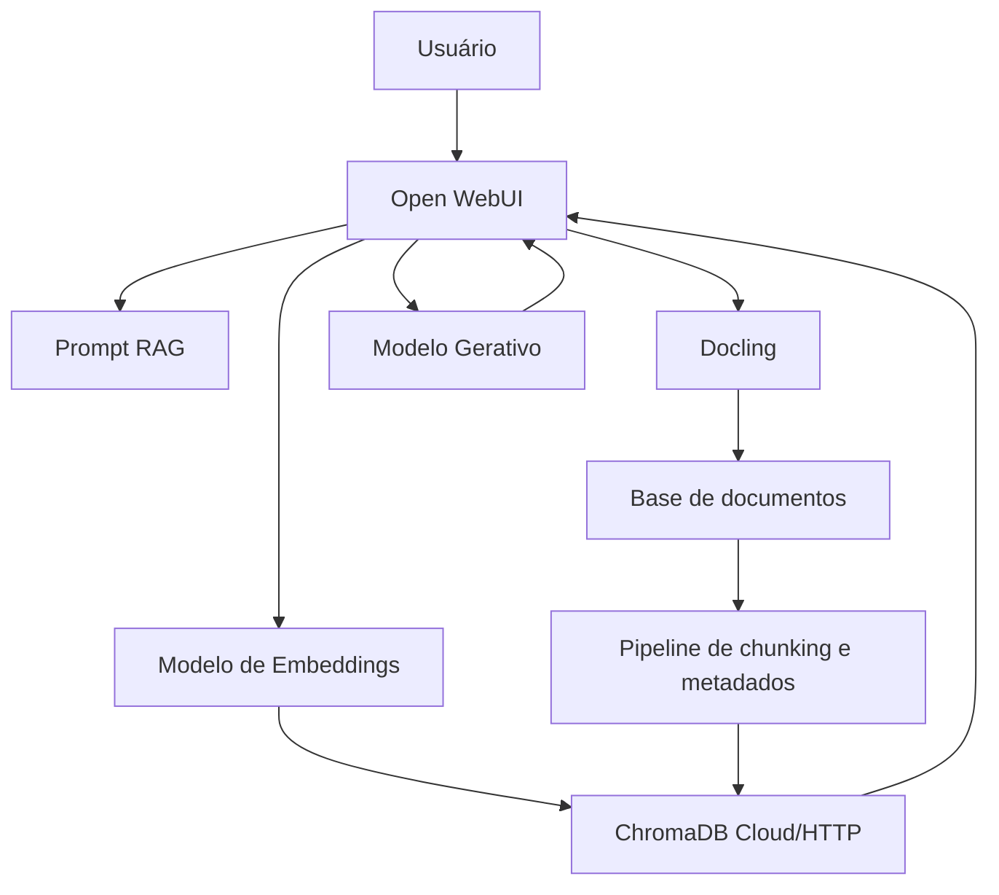

# Relatório Técnico: Desenvolvimento de um RAG Legislativo para Apoio à Consulta de Discursos Parlamentares

## 1. Introdução

### 1.1 Contextualização

O avanço recente dos grandes modelos de linguagem (Large Language Models, LLMs) ampliou o interesse por soluções capazes de responder perguntas em linguagem natural sobre grandes volumes documentais. No setor público, esse potencial é especialmente relevante em contextos nos quais há acervos extensos, dinâmicos e heterogêneos, como legislação, pareceres, notas técnicas, discursos parlamentares e documentos administrativos. Entretanto, o uso direto de LLMs apresenta limitações conhecidas, como alucinações, desatualização do conhecimento e baixa rastreabilidade das evidências utilizadas para compor uma resposta (GAO et al., 2023).

Nesse cenário, a abordagem Retrieval-Augmented Generation (RAG) surge como uma arquitetura adequada para combinar recuperação semântica de documentos com geração textual fundamentada em fontes externas. Em vez de depender apenas do conhecimento paramétrico do modelo, o sistema recupera trechos relevantes de uma base documental e os incorpora ao contexto da resposta, elevando a precisão factual, a atualidade e a auditabilidade do resultado (GAO et al., 2023).

No contexto do Parlamento brasileiro, a organização do conhecimento e a ampliação de mecanismos de acesso à informação já constituem tema relevante de pesquisa aplicada. Cavalcanti (2024) destaca que a inteligência artificial pode apoiar a organização do conhecimento legislativo, desde que utilizada com atenção à estrutura informacional, à mediação documental e à explicabilidade dos resultados. O presente projeto insere-se nesse problema aplicado ao desenvolver um RAG legislativo orientado ao acervo de discursos do Senado Federal.

### 1.2 Motivação

A administração pública lida com forte pressão por transparência, rastreabilidade e eficiência na gestão da informação. Em ambientes parlamentares, a consulta a discursos e pronunciamentos é importante para análise temática, comparação de posicionamentos, apoio a gabinetes, produção de relatórios e atendimento ao cidadão. Todavia, a busca puramente lexical em grandes bases tende a ser insuficiente quando o usuário formula perguntas complexas, comparativas ou orientadas a síntese.

Além disso, soluções baseadas apenas em LLMs generalistas podem gerar respostas convincentes, porém não verificáveis. Em domínios institucionais, essa limitação é particularmente problemática. Deene (s.d.) argumenta que sistemas RAG podem reduzir riscos de governança informacional e conformidade ao deslocar a fonte primária do conhecimento para documentos controlados, atualizáveis e auditáveis. Said (2025), por sua vez, ressalta que, em produção, sistemas RAG exigem não apenas recuperação e geração, mas também versionamento, observabilidade e avaliação contínua.

### 1.3 Objetivo

O objetivo deste trabalho é desenvolver e demonstrar uma solução de RAG legislativo voltada à consulta de discursos parlamentares do Senado Federal, com foco em:

- estruturar uma base de conhecimento consultável a partir de discursos parlamentares;
- permitir perguntas em linguagem natural com respostas fundamentadas em trechos recuperados;
- avaliar empiricamente a qualidade inicial da recuperação e da geração;
- documentar uma arquitetura reproduzível, com baixo acoplamento e possibilidade de evolução para cenários institucionais.

## 2. Fundamentação teórica

### 2.1 Arquiteturas de LLM relacionadas ao problema

As arquiteturas mais relevantes para este projeto são as de LLMs generativos baseados em transformadores e os modelos de embeddings usados para busca vetorial. No primeiro caso, o LLM atua como componente de síntese, recebendo uma pergunta e um conjunto de trechos recuperados para compor uma resposta textual. No segundo, modelos de embedding convertem trechos documentais e consultas em vetores de alta dimensão, permitindo cálculo de similaridade semântica em banco vetorial.

No RAG, esses componentes operam de forma complementar: o modelo de embedding suporta a etapa de recuperação, enquanto o modelo generativo suporta a etapa de composição de resposta. Gao et al. (2023) classificam as arquiteturas RAG em formas mais ingênuas, avançadas e modulares. Para o problema legislativo, a arquitetura modular é particularmente adequada, pois facilita a substituição independente de extratores, modelos de embedding, banco vetorial, reranqueadores e modelos gerativos.

### 2.2 Técnicas relacionadas

As principais técnicas empregadas no projeto foram:

- **extração documental**: conversão e preparação do texto para ingestão na base de conhecimento;
- **chunking**: segmentação dos documentos em unidades menores para indexação vetorial;
- **embeddings semânticos**: representação vetorial de chunks e consultas;
- **recuperação vetorial**: busca dos trechos mais relevantes para a consulta;
- **reranqueamento e seleção contextual**: filtragem do contexto enviado ao modelo;
- **prompting orientado a evidências**: instruções para privilegiar o contexto recuperado, limitar inferências e distribuir citações ao longo da resposta.

Entre essas técnicas, o chunking tem papel decisivo. Singh (2025) discute que estratégias de segmentação inadequadas podem prejudicar a recuperação ao quebrar o contexto semântico ou, no extremo oposto, gerar blocos excessivamente grandes, reduzindo precisão. No presente projeto, o desenvolvimento exigiu ajustes iterativos de chunking para equilibrar qualidade de recuperação e restrições operacionais do banco vetorial em nuvem. A experiência prática confirmou a literatura: o chunking não é uma etapa acessória, mas um dos principais fatores de desempenho de um RAG.

Said (2025) acrescenta que, em ambientes reais, técnicas de avaliação, observabilidade e versionamento são tão importantes quanto o pipeline básico de recuperação. Essa perspectiva foi incorporada ao projeto por meio de scripts próprios de importação, avaliação e documentação de parâmetros.

### 2.3 Trabalhos e soluções relacionadas

Gao et al. (2023) oferecem a base conceitual mais abrangente para compreender o RAG como solução para problemas de desatualização, baixa explicabilidade e geração não rastreável em LLMs. O trabalho também orienta a decomposição do problema em recuperação, aumento de contexto e geração.

No campo jurídico e regulatório, Deene (s.d.) discute o potencial do RAG para reduzir riscos associados ao uso corporativo de IA, especialmente por aumentar controle sobre fontes, facilitar atualização e favorecer mecanismos de responsabilização. Embora o texto esteja voltado ao contexto empresarial e de proteção de dados, seus argumentos são aplicáveis ao setor público por analogia institucional.

No domínio político, Khaliq et al. (2024) demonstram que arquiteturas RAG podem apoiar tarefas de fact-checking político com raciocínio apoiado em evidências externas. Ainda que o foco do presente projeto não seja verificação factual multimodal, o trabalho mostra que o domínio político-parlamentar é compatível com abordagens RAG e se beneficia de estruturas de recuperação rigorosa.

Por fim, Cavalcanti (2024) aproxima a discussão da realidade do Parlamento brasileiro ao tratar da inteligência artificial na organização do conhecimento legislativo, reforçando a pertinência da aplicação de IA explicável e documentalmente ancorada em contextos institucionais.

## 3. Caracterização do problema

### 3.1 Problema da administração pública

O problema central é a dificuldade de transformar grandes acervos parlamentares em bases efetivamente consultáveis por perguntas em linguagem natural, com respostas úteis, verificáveis e contextualizadas. Embora os discursos legislativos sejam públicos, seu volume e diversidade dificultam a recuperação eficiente de argumentos, temas, posicionamentos e referências temporais apenas por mecanismos tradicionais de busca.

Na prática, isso afeta:

- gabinetes parlamentares que precisam recuperar rapidamente posicionamentos anteriores;
- equipes técnicas que elaboram notas, pareceres e subsídios;
- pesquisadores e jornalistas que investigam temas legislativos;
- cidadãos interessados em transparência e controle social.

Sem uma camada semântica de recuperação, a consulta tende a ser fragmentada, lenta e dependente de conhecimento prévio do acervo.

### 3.2 Partes interessadas

As partes interessadas do projeto incluem:

- gabinetes parlamentares;
- consultorias legislativas e assessorias técnicas;
- equipes de transparência e gestão da informação;
- pesquisadores em ciência política, direito e administração pública;
- cidadãos e organizações da sociedade civil;
- equipes de tecnologia responsáveis por operação e manutenção da solução.

### 3.3 Critérios de sucesso

Os critérios de sucesso definidos para o laboratório foram:

- capacidade de indexar uma base representativa de discursos parlamentares;
- recuperação de trechos relevantes para perguntas factuais e analíticas;
- geração de respostas em português com base prioritária no contexto recuperado;
- inclusão de referências e metadados dos discursos utilizados;
- possibilidade de importação e avaliação automatizadas;
- reprodutibilidade da solução em ambiente local/containerizado.

## 4. Proposta de solução

### 4.1 Diagrama de arquitetura da solução

A solução foi implementada com três serviços principais:

- **Open WebUI** como interface de interação e orquestração do fluxo RAG;
- **Docling** para extração e preparação de conteúdo documental;
- **ChromaDB** como banco vetorial acessado por HTTP.

O ambiente foi definido em `docker-compose.yaml`, com serviços em `network_mode: host`, reduzindo complexidade de conectividade local. O sistema também foi configurado para operar tanto com embeddings locais via Ollama quanto com embeddings via OpenAI, sendo esta segunda opção a utilizada na configuração experimental validada.

### 4.2 Pipeline desenvolvido

O pipeline do projeto foi composto pelas seguintes etapas:

1. **Aquisição dos dados**: uso do dataset `fabriciosantana/discursos-senado-legislatura-56`.
2. **Pré-processamento e seleção textual**: priorização do campo `TextoDiscursoIntegral`, com fallback para `Resumo` e `Indexacao`.
3. **Chunking em nível de palavras**: geração de segmentos com metadados por chunk.
4. **Geração de arquivos de ingestão para Open WebUI**: lotes markdown estruturados e um arquivo `jsonl` de referência.
5. **Importação automatizada**: script para upload dos batches, monitoramento do processamento e inclusão na knowledge base do Open WebUI.
6. **Indexação vetorial**: embeddings gerados e persistidos no ChromaDB.
7. **Consulta RAG**: recuperação vetorial, montagem de contexto, aplicação do prompt e geração da resposta.
8. **Avaliação inicial**: execução automatizada de perguntas de teste e exportação de resultados em JSONL, Markdown e CSV.

O script `build_openwebui_knowledge_from_hf.py` sintetiza bem a fase de preparação. Ele gera chunks com metadados como data, autor, partido, unidade da federação, tipo de uso da palavra, resumo, indexação e URL do texto integral. Essa modelagem favorece tanto a recuperação semântica quanto a geração posterior de referências documentais.

### 4.3 Principais contribuições

As principais contribuições do projeto foram:

- construção de um ambiente reprodutível de RAG legislativo;
- adaptação do pipeline para um acervo real do Senado Federal;
- definição de um formato de chunk com metadados úteis para auditoria e referência;
- automatização da importação em lote para o Open WebUI;
- automatização de avaliação básica com conjunto de perguntas e rubric;
- validação prática de parâmetros de chunking e de conectividade com ChromaDB remoto.

### 4.4 Riscos e limitações

Os principais riscos e limitações identificados foram:

- sensibilidade do desempenho à estratégia de chunking;
- possibilidade de mistura excessiva de fontes em perguntas muito abertas;
- dependência da qualidade dos documentos e metadados de origem;
- risco de respostas expansivas ou inferenciais quando o prompt não é suficientemente restritivo;
- dependência de quotas e limites operacionais de serviços externos, como embeddings e banco vetorial.

Deene (s.d.) e Said (2025) ajudam a interpretar esses riscos de forma mais ampla: um RAG melhora controle e auditabilidade, mas não elimina automaticamente problemas de qualidade documental, governança, avaliação e conformidade.

## 5. Experimentos / Demonstração

### 5.1 Setup experimental

O experimento utilizou uma base derivada do dataset `fabriciosantana/discursos-senado-legislatura-56`, contendo:

- 15.729 registros de entrada;
- 15.726 discursos efetivamente escritos;
- 3 registros descartados por ausência de texto útil;
- 23.806 chunks gerados;
- 120 arquivos markdown de ingestão.

Esses números foram registrados em `knowledge_openwebui/build_metadata.json`.

Na etapa de construção da base, foram usados os seguintes parâmetros:

- `max_words = 850`;
- `overlap_words = 150`;
- `chunks_per_file = 200`.

Na configuração operacional validada no Open WebUI, foram adotados:

- `Chunk Size = 6000`;
- `Chunk Overlap = 500`;
- `Chunk Min Size Target = 2000`;
- `Markdown Header Text Splitter = habilitado`;
- modelo de embedding `text-embedding-3-small`;
- batch de embeddings `32`.

O prompt RAG foi evoluído ao longo do laboratório para privilegiar:

- uso prioritário do contexto recuperado;
- proibição de invenção de fatos;
- declaração explícita quando a informação não estivesse no contexto;
- citações distribuídas ao longo da resposta;
- inclusão de seção final de referências quando solicitada.

Para avaliação, foi desenvolvido o script `run_rag_eval.py`, que consulta a knowledge base do Open WebUI via API e gera saídas em:

- `.jsonl`, para persistência estruturada;
- `.md`, para revisão qualitativa;
- `.csv`, para scoring manual e comparação entre execuções.

### 5.2 Resultados alcançados

Os resultados do laboratório foram satisfatórios para uma prova de conceito funcional. Em especial:

- a importação de todos os 120 batches foi concluída com sucesso;
- o sistema passou a responder perguntas factuais e temáticas sobre discursos parlamentares com qualidade inicial considerada boa;
- perguntas específicas e atômicas apresentaram melhor desempenho do que perguntas excessivamente abertas ou multifocais;
- a inclusão de referências ao final da resposta mostrou-se viável por meio de instruções de prompt.

Na avaliação empírica, observou-se que:

- perguntas sobre dados objetivos e argumentos centrais de um senador tendem a produzir respostas mais precisas;
- perguntas transversais, comparativas e muito abertas ampliam o risco de sínteses excessivamente largas;
- a qualidade percebida depende não apenas do modelo, mas da combinação entre chunking, prompt e formulação da consulta.

Esses achados são coerentes com a literatura. Gao et al. (2023) observam que RAG não é uma técnica única, mas um pipeline cujo desempenho emerge da interação entre recuperação, aumento de contexto e geração. Said (2025) reforça que avaliação contínua é necessária para detectar regressões e orientar ajustes.

### 5.3 Impacto na administração pública

O impacto potencial para a administração pública é relevante em pelo menos quatro dimensões:

- **transparência**: respostas passam a ser ancoradas em discursos públicos e citáveis;
- **eficiência**: redução do tempo de busca em grandes acervos legislativos;
- **memória institucional**: recuperação mais rápida de posicionamentos anteriores, temas recorrentes e evidências documentais;
- **apoio à decisão**: gabinetes e equipes técnicas podem explorar o acervo de forma mais sistemática.

Além disso, por operar sobre fontes controladas e com possibilidade de referência explícita, a solução é mais compatível com exigências de accountability do que o uso isolado de um chatbot genérico. Esse ponto dialoga tanto com Deene (s.d.) quanto com Cavalcanti (2024).

## 6. Conclusão e trabalhos futuros

### 6.1 Revisão das contribuições

O trabalho desenvolveu uma solução funcional de RAG legislativo voltada ao acervo de discursos do Senado Federal, composta por pipeline de preparação documental, banco vetorial, interface de consulta e scripts auxiliares de ingestão e avaliação. O projeto demonstrou que é possível estruturar uma base semântica consultável e responder perguntas em linguagem natural com apoio em evidências recuperadas.

### 6.2 Discussão e interpretação crítica dos resultados frente aos objetivos

Frente ao objetivo proposto, os resultados foram positivos. A solução atendeu aos requisitos mínimos de indexação, recuperação, geração e automação de testes. No entanto, a experiência também mostrou que a qualidade de um RAG institucional depende de disciplina metodológica: escolha de chunking, desenho de prompt, governança de metadados e avaliação iterativa influenciam diretamente o comportamento final.

Isso confirma a literatura recente. RAG não deve ser entendido apenas como “conectar um LLM a um banco vetorial”, mas como um sistema sociotécnico que exige observabilidade, versionamento e critérios claros de sucesso (SAID, 2025).

### 6.3 Limitações

As limitações atuais incluem:

- avaliação ainda predominantemente qualitativa e manual;
- ausência, nesta etapa, de filtros mais sofisticados por autor, período ou tipo de discurso diretamente no fluxo de geração;
- possibilidade de respostas excessivamente amplas em consultas abertas;
- dependência de serviços externos para embeddings e parte da geração.

### 6.4 Próximos passos

Como trabalhos futuros, recomenda-se:

- ampliar a avaliação automática com framework especializado, como RAGAS ou juiz LLM;
- incorporar filtros estruturados por metadado na recuperação;
- experimentar reranqueadores mais robustos;
- testar diferentes estratégias de chunking por tipo documental;
- implementar pós-processamento determinístico para seção de referências;
- expandir a solução para outros tipos de documentos legislativos, como pareceres, projetos de lei e notas técnicas;
- evoluir o sistema para cenários de geração assistida de minutas e discursos, preservando rastreabilidade e revisão humana.

## Referências

CAVALCANTI, Helen Bento. Inteligência Artificial na Organização do Conhecimento do Parlamento Brasileiro. In: **ISKO Brasil 2024**, Campina Grande. *Anais...* Campina Grande: UFCG, 2024. Disponível em: <https://dspace.sti.ufcg.edu.br/bitstream/riufcg/38144/1/HELEN%20BENTO%20CAVALCANTI-ARTIGO-CI%C3%8ANCIA%20DA%20COMPUTA%C3%87%C3%83O-CEEI%20%282024%29.pdf>. Acesso em: 28 out. 2025.

DEENE, Joris. Can a RAG system reduce the GDPR risks of your enterprise AI? *ICT Lawyer*, s.d. Disponível em: <https://www.ictrechtswijzer.be/en/can-a-rag-system-reduce-the-gdpr-risks-of-your-enterprise-ai/>. Acesso em: 8 abr. 2026.

GAO, Yunfan; XIONG, Yun; GAO, Xinyu; JIA, Kangxiang; PAN, Jinliu; BI, Yuxi; DAI, Yi; SUN, Jiawei; WANG, Meng; WANG, Haofen. Retrieval-augmented generation for large language models: a survey. *arXiv preprint*, arXiv:2312.10997, 2023. Disponível em: <https://arxiv.org/abs/2312.10997>. Acesso em: 28 out. 2025.

KHALIQ, Mohammed Abdul; et al. RAG-Augmented Reasoning for Political Fact-Checking using Multimodal Large Language Models. In: **PROCEEDINGS OF THE SEVENTH FACT EXTRACTION AND VERIFICATION WORKSHOP (FEVER)**, 2024, Miami, Florida, USA. *Proceedings...* Miami: Association for Computational Linguistics, 2024. p. 280-296. DOI: <https://doi.org/10.18653/v1/2024.fever-1.29>. Disponível em: <https://aclanthology.org/2024.fever-1.29/>. Acesso em: 19 nov. 2025.

SAID, Adil. RAG in Practice: Exploring Versioning, Observability, and Evaluation in Production Systems. *Towards AI*, 28 ago. 2025. Disponível em: <https://towardsai.net/p/artificial-intelligence/rag-in-practice-exploring-versioning-observability-and-evaluation-in-production-systems>. Acesso em: 8 abr. 2026.

SINGH, Pankaj. 8 Types of Chunking for RAG Systems. *Analytics Vidhya*, 4 abr. 2025. Disponível em: <https://www.analyticsvidhya.com/blog/2025/02/types-of-chunking-for-rag-systems/>. Acesso em: 8 abr. 2026.
